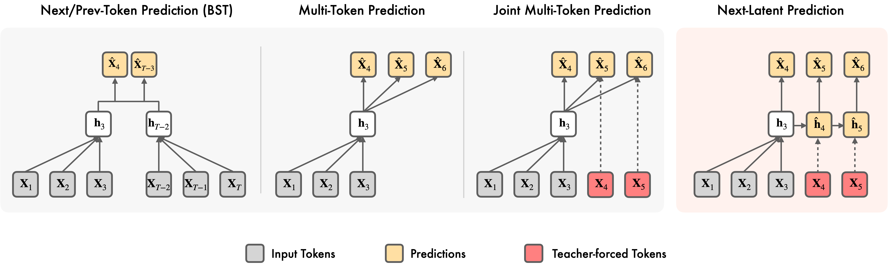

<div align="center">

# Next-Latent Prediction Transformer



[](https://arxiv.org/abs/2511.05963)

<h3>Official codebase for <a href="https://arxiv.org/abs/2511.05963">Next-Latent Prediction Transformers Learn Compact World Models</a></h3>

<i><a href="https://jaydenteoh.github.io/" style="color: #0891B2; text-decoration: none;">Jayden Teoh</a>, Manan Tomar, Kwangjun Ahn, Edward S. Hu, Tim Pearce, Pratyusha Sharma, Akshay Krishnamurthy, Riashat Islam, Alex Lamb, John Langford</i>

</div>

---

## Table of Contents

- [Installation](#installation)
- [Algorithms](#algorithms)
- [Training](#training)
  - [Data](#data)
  - [Configs](#configs)
  - [Training Scripts](#training-scripts)
  - [Reproducibility](#reproducibility)
- [Evaluation](#evaluation)
  - [Manhattan Taxi Rides](#manhattan-taxi-rides)
  - [TinyStories](#tinystories)
  - [FineWeb-Edu Pretraining](#fineweb-edu-pretraining)
- [Citation](#citation)

---

## Installation

```bash
pip install -r requirements.txt
```

**Note:** PyTorch 2.6 or later is required. Earlier versions will raise an error related to `torch.distributed.fsdp`. PyTorch 2.9 or later is required to use the Muon optimizer.


## Algorithms

The code for NextLat and all baseline algorithms can be found in the `models/` folder:

<div align="center">

| File | Algorithm |
|------|-----------|
| [model_nextlat.py](models/model_nextlat.py) | Next-Latent Prediction (NextLat) |
| [model_gpt.py](models/model_gpt.py) | Next-Token Prediction (GPT) |
| [model_mtp_gloeckle.py](models/model_mtp_gloeckle.py) | Multi-Token Prediction (MTP) |
| [model_mtp_jtp.py](models/model_mtp_jtp.py) | Joint Multi-Token Prediction (JTP) |
| [model_bst.py](models/model_bst.py) | Belief State Transformer (BST) |

</div>

The main differences between the algorithms can be best understood via their respective `compute_loss()` functions.

The NextLat training code includes inline comments to help explain the algorithm. However, the logic for handling sequence/document packing and context masking may obscure the core ideas behind NextLat. For a clearer understanding and more trivial implementation, we refer readers to the PyTorch-syntax pseudocode in our paper (Algorithm 1 in appendix).


## Training

### Data

Instructions to generate the training data for each benchmark can be found in [`data/README.md`](data/README.md).

Some datasets are downloaded from Hugging Face. Setting an `HF_TOKEN` enables higher rate limits and faster downloads:
```bash
export HF_TOKEN=<hf_token>
```

### Configs

The YAML configuration files for all algorithms and benchmarks are in the `config/` folder. These files contain the exact hyperparameters needed to replicate the experiment results in our paper.

The `sweep` parameter allows you to train across multiple seeds or perform a grid search over hyperparameters via consecutive training runs:

```yaml
sweep:
  # each dash corresponds to one grid you are searching over
  - seed: [1234, 1235, 1236, 1237, 1238]
    model:
      mtp_horizon: [2, 4, 6, 8]
```


### Training Scripts

`train.py` is the main entry point for all experiments:

- **Single-GPU:**

```bash
CUDA_VISIBLE_DEVICES=0 python train.py --config <training_config>
```

- **Multi-GPU** (via [Lightning Fabric](https://lightning.ai/docs/fabric/stable/)):

```bash
fabric run --strategy ddp --devices <num_gpus> --precision bf16-mixed train.py --config <training_config>
```

In our paper, we only use DDP for the distributed training strategy. Set `<num_gpus>` to the number of available GPUs.

**Ready-to-use bash scripts for every algorithm and benchmark are in the `scripts/` folder.** These already include the corresponding configuration files as inputs to `--config` — the only thing to modify is the number of GPUs.

**Note:** The $A_5$ benchmark uses mismatched input and target sequences. We divert the $A_5$ code and training scripts to the `a5_training` branch to avoid complicating the main code.

### Reproducibility

The results in our paper were produced on NVIDIA RTX A5000, NVIDIA H100 NVL, and NVIDIA B200 GPUs. A few things to be aware of when reproducing results:

**1. `torch.compile` Shenanigans**
We observe that `torch.compile()` produces inconsistent results on numerically sensitive benchmarks like Path-Star and $A_5$, especially on Hopper GPUs (i.e., H100s and H200s). For these benchmarks, we recommend setting:
```yaml
trainer:
  compile: false
```
There is a moderate throughput cost but this ensures reproducibility of our results. We have not yet root-caused this to a specific Inductor pass, and welcome community help in investigating.

**2. Triton Kernels**
Our codebase supports fused linear + cross-entropy Triton kernels via [Liger-Kernel](https://github.com/linkedin/Liger-Kernel). However, we do not use them in our experiments as they tend to interfere with `torch.compile()`, causing substantially slower training and divergent results.

**3. Throughout Performance**
Training and inference speeds measured in our paper are measured on NVIDIA B200 GPUs. To reproduce NextLat's training speed fairly, remove the cross-entropy loss computation in `_nextlat_loss_function()` (it is currently kept only for logging and adds latency).


## Evaluation

We use [Weights & Biases](https://wandb.ai) for metric tracking. Log in via:

```bash
wandb login <wandb_token>
```

Metrics are also logged to CSV files throughout training. Both loggers are enabled by default (see `log_to_wandb` and `log_to_file` in `defaults.yaml`). The experiment name used for logging is determined by the `experiment_name`, `seed`, and `sweep` parameters in the configuration file.

For the *Path-Star Graph* and *Countdown* benchmarks, accuracy metrics are tracked automatically during training — no additional evaluation steps are needed.

The subsections below describe post-hoc evaluations for *Manhattan Taxi Rides* and *TinyStories*.

**Note:** To run these evaluations, model checkpoints must be saved during training. Ensure `save_last_checkpoint` or `save_best_checkpoint` is set to `true` in the YAML configuration file before training.

### Manhattan Taxi Rides

Before running the evaluation, download the required Manhattan pickle artifacts:
```bash
./data/manhattan/random_walks/download_random_walks_hf.sh
```

Afterwards, to evaluate and visualize the model's internal world model of Manhattan (Table 1 and Figure 3 in our paper), refer to the sample script:

```bash
./scripts/manhattan/generate_graphs/generate_nextlat_graph.sh
```
Please modify the `--config` (path to the `materialized_config.yaml` produced in the `output/` folder during training), `--checkpoint_path` (path to the model checkpoint) and `--model_name` (just for naming purposes) argument inputs accordingly. 

This script uses the trained model checkpoint to generate trajectories in Manhattan, which are then used to evaluate the model's internal world model. The corresponding code can be found in `data/manhattan/`:
- `generate_manhattan_trajectories.py`: Generate trajectories in Manhattan using the trained model and save them in the `data/manhattan/samples/` folder as `.txt` files. 
- `make_graphs.py`: Produce the reconstructed graph of Manhattan roads based on the generated trajectories and save them in the `data/manhattan/graphs/` folder as `.pkl` files.
- `compression_test.py`: Evaluate the sequence compression metric.
- `detour_test.py`: Evaluate the detour robustness metric.
- `latent_compression.py`: Evaluate the effective latent rank metric.

**Note:** As described in the appendix of the paper, we evaluate the models only on pickup-dropoff pairs with shortest paths of up to 50 steps. These pairs are pre-generated using the `make_pairs.py` script and you should have downloaded it from HuggingFace via the script above as `data/manhattan/random_walks/eval_pairs_dist50.pkl`.

Finally, to visualize the world models:

```bash
cd data/manhattan
python make_maps.py
```

This script reads the generated graphs from `data/manhattan/graphs/` and produces `.png` screenshots as well as interactive `.html` maps in `data/manhattan/maps/`.

**Note:** These scripts (except `latent_compression.py`) are adapted from the original paper's [GitHub repository](https://github.com/keyonvafa/world-model-evaluation). Appendix D.1 in our paper clarifies the differences in our evaluation setup.

### TinyStories

After training on TinyStories, we freeze the models and train linear probes on the hidden states to predict 1–20 tokens ahead. Refer to the sample script:

```bash
./scripts/tinystories/probe/train_nextlat_probe.sh
```
This script calls the `train_probe.py` training script. Please modify the `--config` (path to the configuration file) and `--checkpoint_path` (path to the model checkpoint) argument inputs accordingly. The corresponding configuration files to train probes for each algorithm can be found in `config/tinystories/probe/`.

During training of these probes, the cross-entropy losses will be logged to Wandb/CSV.


### FineWeb-Edu Pretraining

- **Downstream LM benchmarks** — We evaluate pretrained checkpoints on downstream tasks using the [LM Evaluation Harness](https://github.com/EleutherAI/lm-evaluation-harness) in `eval/eval_checkpoints.py` and `eval/lm-eval.py`. You can edit the task list via the YAML config passed to `--eval_config` (default: `config/fineweb/lm_eval_fineweb.yaml`).
- **Self-speculative decoding** — We benchmark the self-speculative decoding performance of the multi-token prediction models (i.e., JTP, MTP, and NextLat) across several domains using `eval/eval_speculative_checkpoints.py`. The speculative sampling algorithm is implemented in `utils/speculative_sampling.py`. Use `--gamma` to set the draft length per step.

**Note:** Acceptance metrics (`acceptance_rate`, `avg_accepted_tokens_per_step`) for self-speculative decoding evaluations exclude position 1, which is equivalent to next-token prediction and is almost always accepted.


## Citation

If you find this work useful, please cite our paper:

```bibtex
@misc{teoh2026nextlatentpredictiontransformerslearn,
      title={Next-Latent Prediction Transformers Learn Compact World Models}, 
      author={Jayden Teoh and Manan Tomar and Kwangjun Ahn and Edward S. Hu and Tim Pearce and Pratyusha Sharma and Akshay Krishnamurthy and Riashat Islam and Alex Lamb and John Langford},
      year={2026},
      eprint={2511.05963},
      archivePrefix={arXiv},
      primaryClass={cs.LG},
      url={https://arxiv.org/abs/2511.05963}, 
}
```